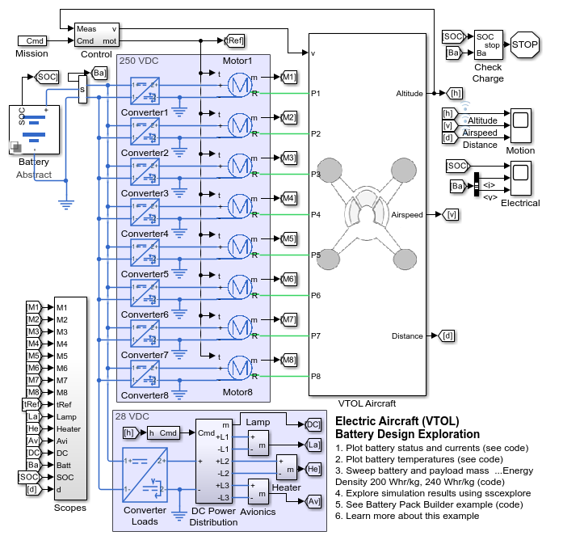
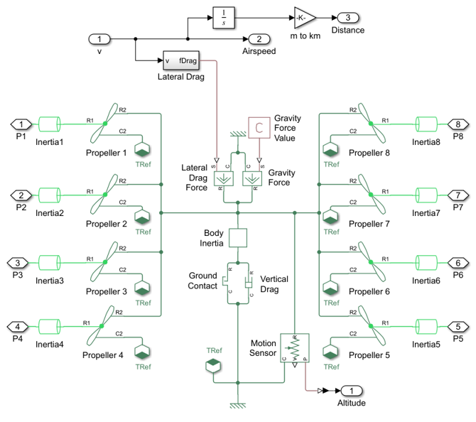
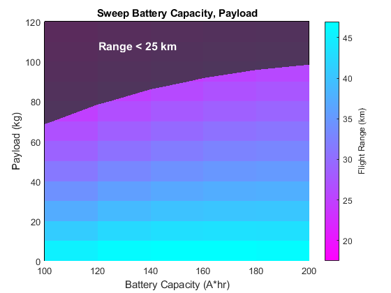
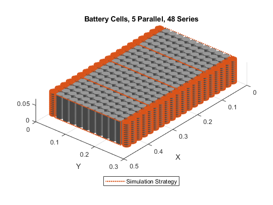
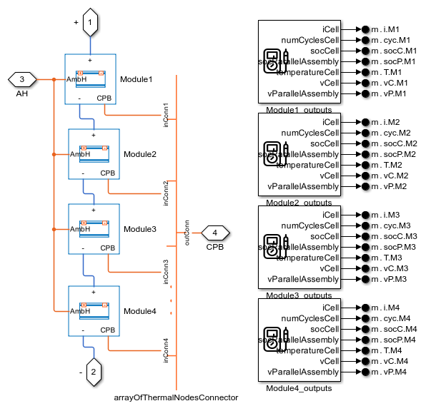
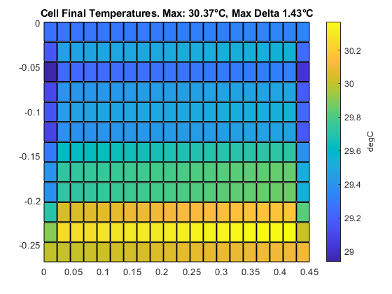

# **Electric Aircraft (VTOL) Battery Pack Model with Simscape&trade;**
Copyright 2022 The MathWorks, Inc.

This example models a vertical takeoff and landing (VTOL) aircraft and
explores the workflow of designing the battery pack.

* **Batteries, motors, and propellers** are integrated to model the aircraft
* **Parallel simulations** are used to identify battery energy density requirements 
* **Manufacturer-specific parameters** characterize the battery cell model.
* **Loadcases of battery current** are determined from mission simulations.
* **Battery pack architectures** are assembled using MATLAB commands.
* **Thermal requirements** are determined by setting target temperature gradients.
* **Cooling plate designs** are explored at the module and pack level.

Open the project file Airtaxi_VTOL.prj to get started.

## **Main Aircraft Model**

## **Chassis and Propeller**

## **Design Space: Battery Capacity and Payload**

## **Battery Pack Configuration**

## **Battery Pack Model**

## **Battery Pack Temperature Gradient**

To learn more about modeling and simulation with Simscape, please visit:
* [Simscape Getting Started Resources](https://www.mathworks.com/solutions/physical-modeling/resources.html)
* Product Capabilities:
   * [Simscape&trade;](https://www.mathworks.com/products/simscape.html)
   * [Simscape Battery&trade;](https://www.mathworks.com/products/simscape-battery.html)
   * [Simscape Driveline&trade;](https://www.mathworks.com/products/simscape-driveline.html)
   * [Simscape Electrical&trade;](https://www.mathworks.com/products/simscape-electrical.html)
   * [Simscape Fluids&trade;](https://www.mathworks.com/products/simscape-fluids.html)
   * [Simscape Multibody&trade;](https://www.mathworks.com/products/simscape-multibody.html)
